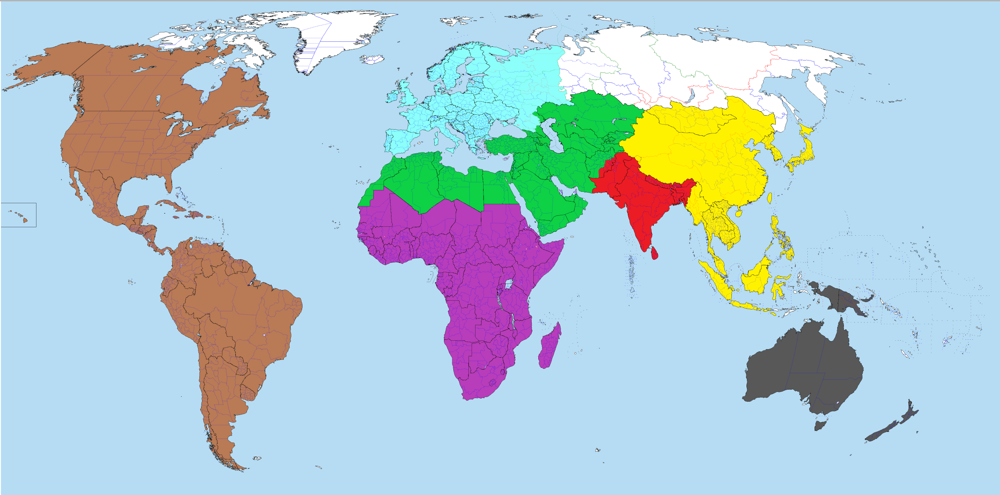

<!DOCTYPE html>
<html>
<body>

<h2>Map of the World</h2>

Click on the map to see the recipes!:

<map name="world">
  <area shape="rect" coords="1361,374,1546,589" alt="South Asia" href="https://www.cia.gov/the-world-factbook/south-asia/">
  <area shape="rect" coords="1466,246,1808,673" alt="East and Southeast Asia" href="https://www.cia.gov/the-world-factbook/east-and-southeast-asia/">
  <area shape="rect" coords="837,160,1173,292" alt="Europe" href="https://www.cia.gov/the-world-factbook/europe/">
  <area shape="rect" coords="1624,709,2118,1019" alt="Oceania" href="https://www.cia.gov/the-world-factbook/australia-and-oceania/">
  <area shape="rect" coords="873,364,1323,428" alt="North Africa, Middle East, and Central Asia" href="https://open.lib.umn.edu/worldgeography/chapter/8-8-end-of-chapter-material/#:~:text=North%20Africa%2C%20Southwest%20Asia%2C%20and%20Central%20Asia%20%28Turkestan%29,areas%20of%20all%20three%20regions%20of%20the%20realm.">
  <area shape="rect" coords="841,460,1183,911" alt="Sub Saharan Africa" href="https://www.cia.gov/the-world-factbook/africa/">
  <area shape="rect" coords="20,72,741,1077" alt="The Americas" href="https://www.britannica.com/place/Americas">
</map>

</body>
</html>
