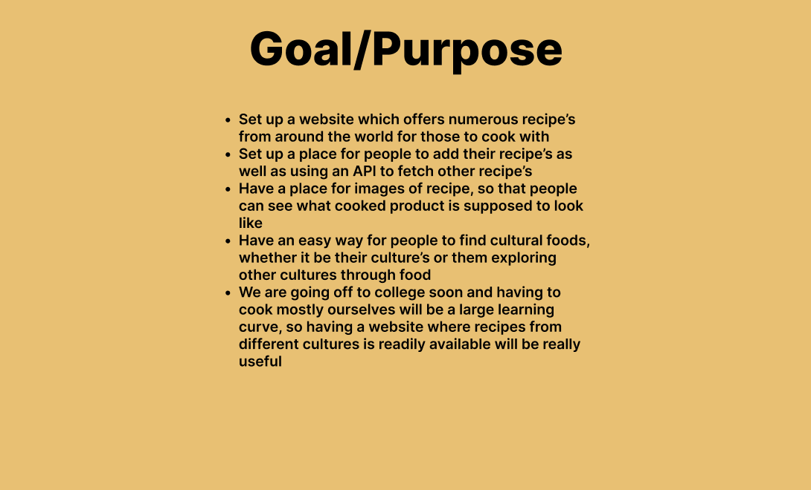
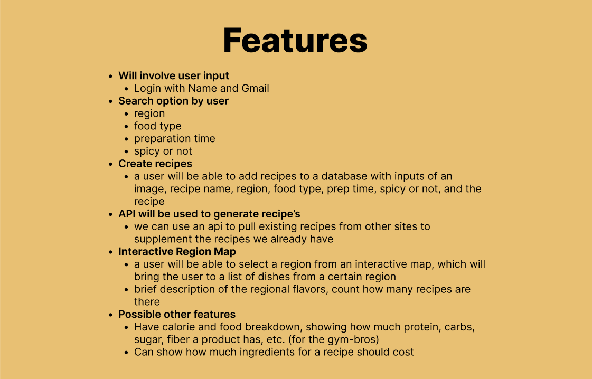
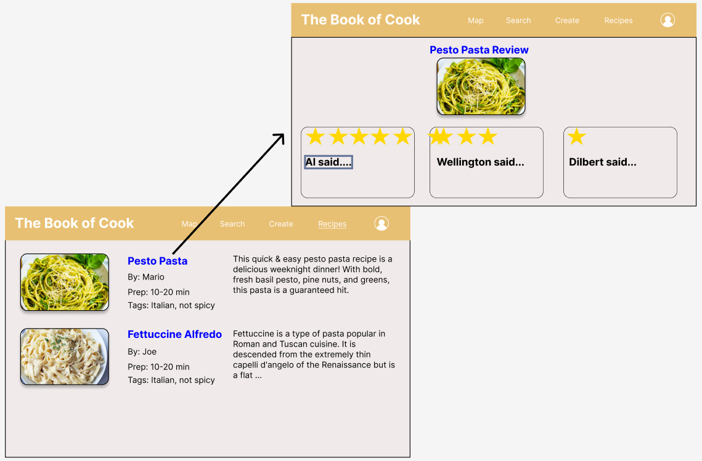
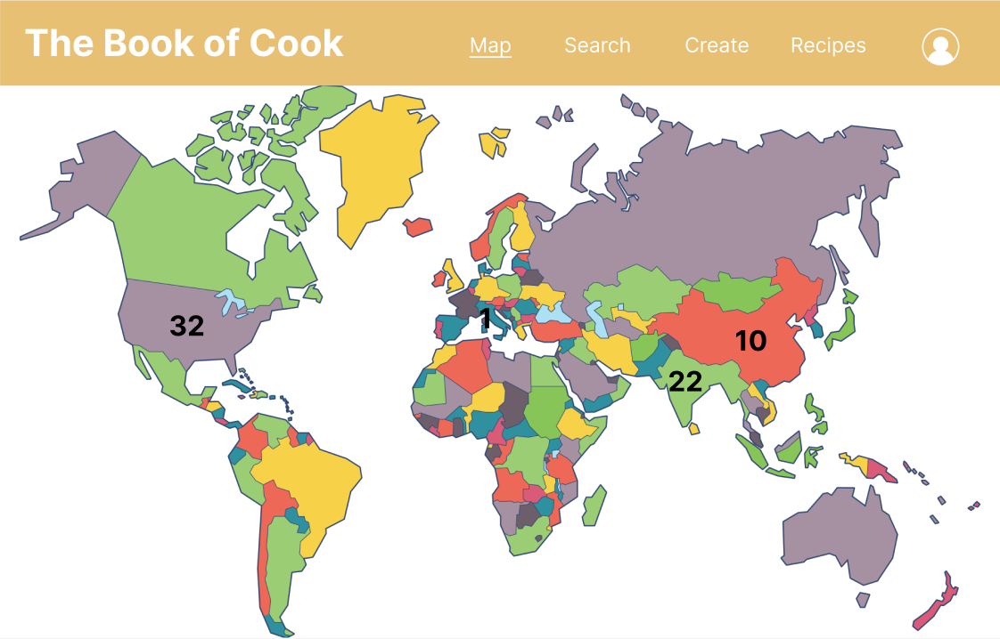
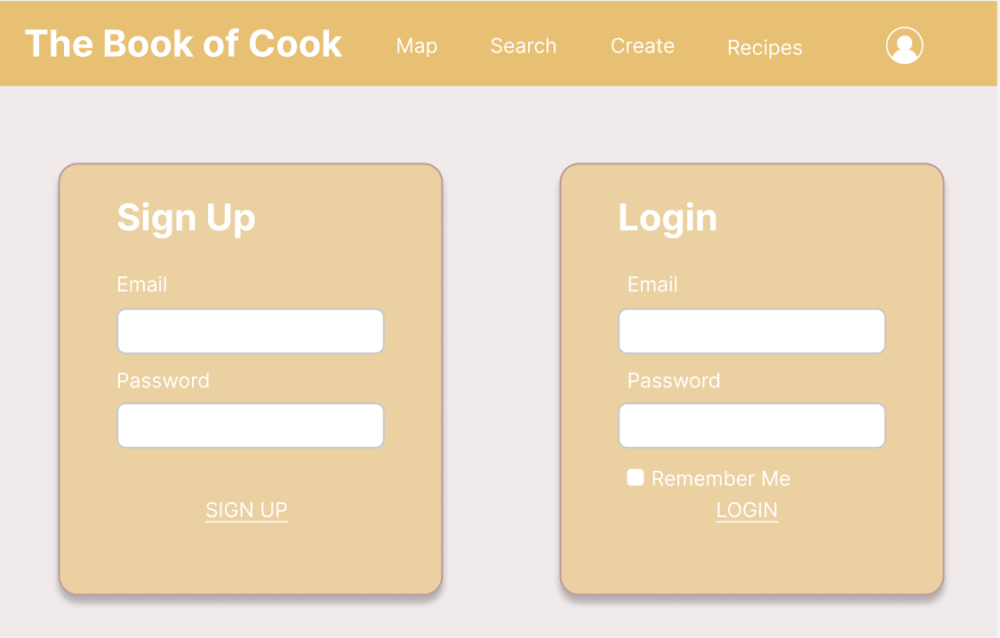

<h1>Plan</h1>

<h1>Wireframes</h1>

<a href="https://ninjabreadlord.github.io/indochina/idea" style = "font-size: 15px;">html example for creating a recipe</a>

<h1>Agile</h1>
<a href="https://github.com/users/NinjaBreadLord/projects/4/views/1" style = "font-size: 15px;">Scrumboard</a>

   <ol type="1">
      <li>One thing we really want to focus on is making sure that everyone knows what they are doing at all times and have a plan of what the next thing we are going to do is.</li>
      <li>We will make sure to always understand each other's code and what other people are doing, so we can understand the functionality of each part of our project.</li>
      <li>We will make sure to periodically talk about new features we want to implement and we would to make sure that everyone is still invested in the project and so we always have fresh ideas.</li>
      <li>We will make sure that we always have review tickets of the features we all implement and show commits of what code we are making.</li>
   </ol>